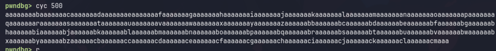
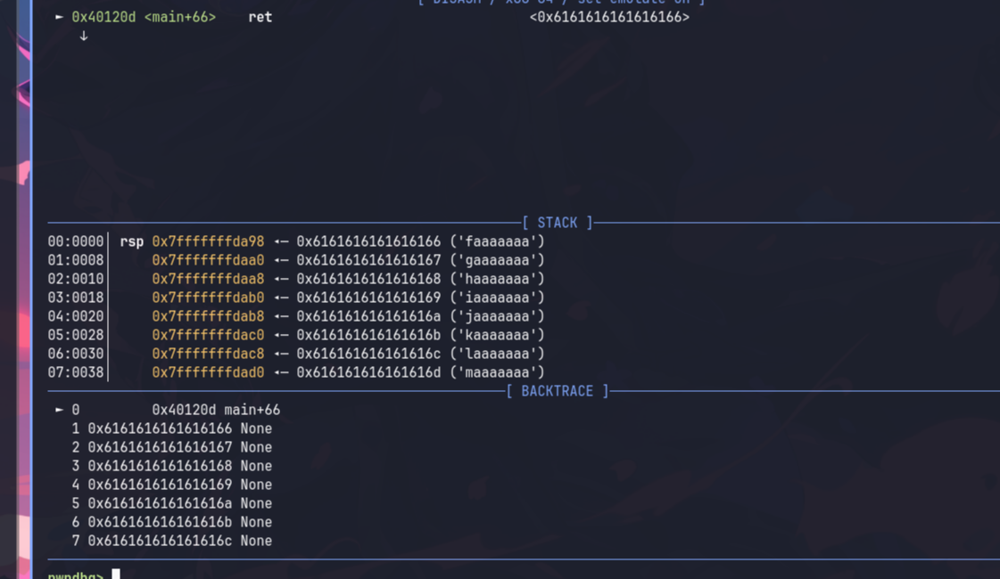
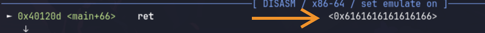
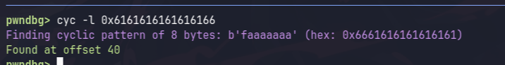

# Binary Exploitation Tips

## Tools yang dipake
- Ghidra
- pwninit
- pwntools 
- gdb with pwndbg

## Cara Pake Pwntools

Buat ngejalanin script pwntools (yang `solve.py`) kek gini.
- `./solve.py LOCAL`, kalau ngetes di local (jadi solving dulu sebelum ke remote)
- `./solve.py`, kalau mau dapetin flag di remote. 
> ***Jangan Lupa!***
>
> Ganti `host` dan `port` di `solve.py` dengan host dan port yang diberikan soal.
> Misal di soal dikasih `nc 12.12.12.12 6969`, ganti `host` jadi `12.12.12.12` dan `port` jadi `6969`.


Yang penting ini si syntaxnya, jangan lupa kalau kita pake pwntools kita bekerja pake bytes, jadi mau send sesuatu itu harus byte (contoh mau send string `'TEST'` caranya itu kek gini `b'TEST'`)
- `p.sendline(<byte_string>)`: sama kayak kalian input sendiri terus pencet enter
- `p.recv(<jml_byte>)`: menerima byte sebanyak `jml_byte`, hasilnya direturn. biasanya kepake buat leak leakan
- `p.recvline()`: menerima line sebanyak 1 line, hasilnya direturn. biasanya kepake buat leak leakan
- `p.recvline_contains(<string>)`: menerima line sebanyak 1 line, hasilnya direturn. biasanya kepake buat leak leakan juga yang ada text spesifik, contohnya `Ini leak binary: 0x551212121212`,
kalau mau ambil valuenya kek gini
```py
leak = eval(p.recvline_contains(b'Ini leak binary: ').split()[-1])
logx.leak # ini fungsinya khusus pake pwninit yang aku kasih kemaren
```


## Checklist


### Checksec (Binary Protections)
```sh
gdb <nama_binary> -ex "checksec"
# atau
checksec --file=<nama_binary>
```

#### RELRO (Relocation Read-Only)
Gausah diperhatikan untuk sekarang, ga ada soal yang ngaruh
#### Stack Canary
- **Enabled**: Kemungkinan ga bisa overflow, Kecuali kalau misalkan soalnya ngasih nilai canary bisa overflow.
- **Disabled**: Langsung overflow ke return address, classic buffer overflow

#### NX (No-Execute)
- **Enabled**: Stack ga executable, artinya ga bisa shellcoding 
- **Disabled**: Bisa inject shellcode langsung

#### PIE (Position Independent Executable)
- **Enabled**: Binary address random tiap run, butuh leak base binary address. Contohnya kek gini binary address: `0x551231451234`
- **Disabled**: Address fixed, bisa langsung cari fungsi `win()` terus overflow return address jadi `win()`

### Cari Vulnerability

Kalau ini memang harus kalian cari sendiri, cuma aku kasih pattern pattern gimana spotnya.

#### Integer Overflow
Terjadi kalau ada operasi aritmatika yang hasilnya melebihi batas tipe data.

**Signed vs Unsigned**:
- `int` (signed 32-bit): range `-2147483648` sampai `2147483647`
- `unsigned int`: range `0` sampai `4294967295`

**Pattern yang sering muncul**:

```c
// Contoh 1: Size check bypass dengan read
char buffer[100];
int size;
scanf("%d", &size);
if (size > 100) {
    exit(1);  // Coba kalau size = -1? Lolos check!
}
read(0, buffer, size);  // read() cast ke size_t (unsigned), -1 jadi 0xFFFFFFFF → overflow!
```

```c
// Contoh 2: Negative index
int array[10];
int index;
scanf("%d", &index);
if (index < 10) {
    array[index] = value;  // Kalau index = -5? Bisa write ke belakang array!
}
```

```c
// Contoh 3: Loop counter overflow
char buffer[32];
unsigned char count;  // max 255
scanf("%hhu", &count);
for (int i = 0; i < count + 1; i++) {  // Kalau count = 255, count + 1 = 0 → loop skip!
    buffer[i] = 'A';
}
```


#### Buffer Overflow
Biasanya ada fungsi yang menerima input dari user, misalnya `gets()`, `scanf()`, `read()`, dll. 
Dan nilai argumennya ini lebih gede dari buffer.

Kalo `gets()` ini pasti buffer overflow soalnya memang unbounded.
```c
void vuln() {
    char buffer[16];
    gets(buffer);
}
```
<details>
<summary>💡 <b>TIPS: Cara Hitung Offset Dengan GDB</b></summary>

**1. Jalanin binary di gdb**
```sh
gdb <nama_binary>
```

**2. Run binary**
```sh
r
```

**3. Generate pattern cyclic**
```sh
cyc 500 
```
Angka terakhir itu sizenya, bisa kalian gedein misal 500. Hasilnya string panjang:



**4. Jalanin ulang program pake `r`**
```sh
r
```

**5. Paste pattern sebagai input**

Kalau diminta input, langsung paste hasilnya. Kalau buffer overflow ada, bakalan freeze:



**6. Copy hex yang ada di `ret`**



**7. Hitung offset**
```sh
cyc -l <hasil_copy>
```
Nanti ketemu offsetnya:



</details>


Terus kalo yang lain patternya kek gini

```c
char buffer[16];
scanf("%s", buffer); // Ini pasti vulnerable, sama aja kek gets()
read(0, buffer, 1000); // argument ke 3 ini ukuran input, kalo lebih gede dari nilai buffer berarti overflow
fgets(buffer, 1000, stdin) // sama kek di atas cuma beda fungsi aja
```

#### Format String Bug

Biasanya ada fungsi `printf()`, terus yang masuk ke `printf()` ini input kita sendiri. Kalau di ghidra ini variable namanya beda.

Kalau dia kek `local_***` berarti kemungkinan besar itu dia input punya kita dan vulnerable.

Kalau dia `DAT_********` kemungkinan besar gabisa. Tapi janlup, coba coba saja

**Python snippet buat generate payload leak stack:**
```python
# Generate format string payload: %1$p.%2$p.%3$p...
start_offset = int(input("Start offset: "))
payload = ".".join([f"%{i}$p" for i in range(start_offset, start_offset + 10)])
print(payload)
```

Jalanin itu kalo ada vuln kek gitu. Kadang yang di leak value biasa, kadang flagnya.

#### Shellcode

Untuk shellcode bisa liat materi yang di slides, tipe soal cuma ada 3, di folder [Shellcode1](./Shellcode1), [Shellcode2](./Shellcode2), [Shellcode3](./Shellcode3) udah ada solver untuk setiap tipe soal.

#### Return Oriented Programming

ROP dipake kalau NX enabled (ga bisa inject shellcode). Intinya kita manfaatin instruksi yang udah ada di binary atau libc untuk ngejalanin perintah yang kita mau.

**Konsep:**
- Gadget = potongan instruksi yang diakhiri dengan `ret`
- Kita chain gadget-gadget ini untuk ngejalanin perintah
- Contoh gadget: `pop rdi; ret` (buat masukin argument ke fungsi)

**Cara cari gadget:**

Jalanin binary di gdb
```sh
gdb <nama_binary>
```
Contoh nyari gadget kek gini
```sh
rop --grep "pop rdi ; ret" 
```

**Contoh simple ROP chain (manggil `win()`):**
```python
# ...
rop = ROP(exe)
rop.call(exe.sym.win)  # panggil fungsi win()

payload = flat(
    b"a" * offset,
    rop.chain(),
)
```

Untuk soal yang lebih kompleks (ret2libc), liat folder [Ret2Libc](./Ret2Libc).
