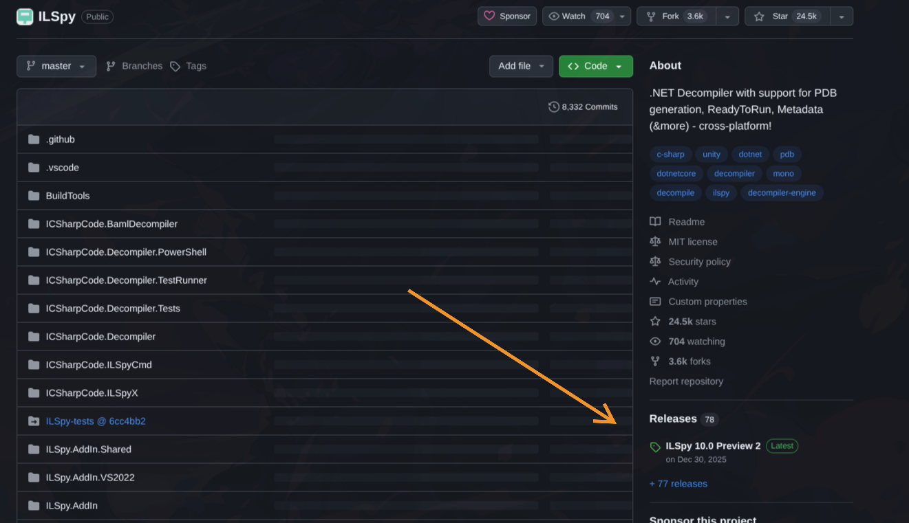

# Cheatsheet Reverse Engineering

Karena reverse engineering itu tool based, dan terlalu banyak tipenya make sure kalian tau yang biasa biasa ada toolsnya apa aja.

## C/C++ Binary

Ini yang biasa, binary ELF 64-bit atau PE (.exe). Buka saja di Ghidra terus analisis source codenya dan coba memahaminya.

## Python Compiled Binary
Ciri-cirinya kalau kalian lakukan `strings <binary> | grep Python`, muncul baris baris yang mengandung keyword Python.
Cara mengerjakannya:
- Kalian ke website ini [PyInstxtractor](https://pyinstxtractor-web.netlify.app/) dan upload binary kalian.
- Setelah itu kalian extract .zipnya terus cari file `.pyc` yang sus, misal namanya `chall.pyc` atau `coba.pyc`. Contoh yang gak sus itu yang namanya `struct.pyc` atau `pyi.******.pyc`. Yang kek gitu di skip aja.
- Setelah menentukan file `.pyc` langsung masukkan ke website ini [Pylingual](https://pylingual.io/)
- Nanti hasilnya bakalan kayak source code Python biasa.

## Java Compiled Binary
Kalau java compiled binary biasanya dia `.class` atau `.jar`, tinggal masukkin [Decompiler Java Online](http://javadecompilers.com/) dan nanti bakalan keluar hasil source code javanya.

## .NET compiled binary
Ciri-cirinya kalau dijalanin command `file` nanti bakalan muncul keyword kayak `.NET` atau `dotNET`. 
Cara mengerjakannya bisa pake [ILSpy](https://github.com/icsharpcode/ILSpy) atau [dnSpy](https://github.com/dnSpy/dnSpy)
> **Note:**
>
> Kalau mau download suatu aplikasi dari GitHub, downloadnya di bagian `Releases` ya ges.
> 

## Android Application

Mirip kayak yang Java, masukkin [Decompiler APK](https://www.javadecompilers.com/apk) aja.
