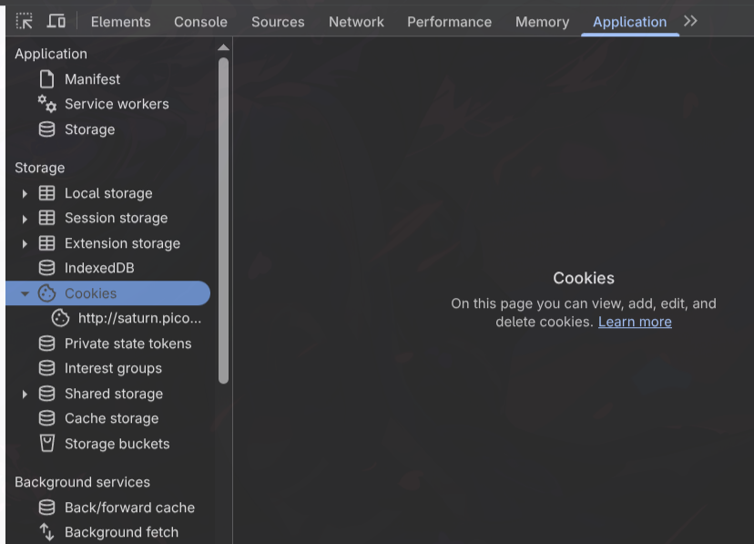
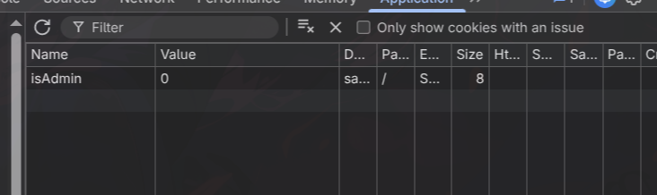

# Cheatsheet Web Exploitation

## Tools
- Burp Suite

## Path Traversal

Biasaya payloadnya cuma `../../../../flag.txt` atau file semacamnya.

## Cookie Injection

Maap kemaren kelupaan materi ini, nanti aku kasih brief overview contoh ngerjainnya kek gimana yak.

Intinya browser kalian itu ngesave sesuatu namanya cookie, yang berisi informasi tentang *sesi* yang sebelumnya kalian tinggal. Mungkin kalian pernah pencet **Remember me**, nah itu berarti cookie kalian disimpan dan ketika kalian mau login lagi gausah ngetik username dan password udah otomatis login.

Seharusnya, cookie yang disimpan diencrypt dengan menggunakan secret key / token. Tetapi kalau tidak di-encrypt kita bisa ngedit sendiri. Contoh kasusnya kek gini,
Kalian login sebagai user `user:pass`, terus di cookie ada field `isAdmin: false`, kalian bisa ganti adminnya jadi `true` terus dapet admin. 

Aku bakalan contohin soal ini: [PicoCTF - power cookie](https://play.picoctf.org/practice/challenge/288?page=1&search=cookie)

- Kalau kita liat sekilas websitenya keknya ga ada apa apa gitu,

- Tapi ternyata websitenya menyimpan cookie, cara liatnya kalo pake Google Chrome, `Inspect Element -> Application`, terus muncul di kiri ada `Cookies`.

- Nah pencet aja yang `http://saturn...`

Ternyata ada field `isAdmin`, valuenya ganti `1` aja, refresh webnya nanti dapet admin.

[PicoCTF Power Cookie](https://medium.com/@dradean/picoctf-writeup-series-power-cookie-32b9e998b638)
[PicoCTF Cookies Writeup](https://medium.com/@harshleenchawla06/pico-ctf-web-exploitation-walkthrough-part-2-6-10-a2aae82d4e95)

## SQLi

Disini ada cheatsheet lengkap buat SQL Injection [PayloadsAllTheThings](https://github.com/swisskyrepo/PayloadsAllTheThings/tree/master/SQL%20Injection)

Make sure kalian milih versi SQL yang sesuai, biasanya yang common itu SQLite karena Flask (Framework web berbasis Python yang biasanya dipake buat challenge CTF) itu menggunakan SQLite.
Kalo soalnya ga dikasih source code/query SQL asli kalian kira kira aja, misalnya kalo dia login bisa asumsi aja querynya kayak gini:
```sql
SELECT * FROM users WHERE username = '<input_username>' AND password = '<input_password>';
```

## SSTI

Materi dan payload yang lengkap ada di sini: [Me2nuk - SSTI Vulnerability](https://me2nuk.com/SSTI-Vulnerability/#flask-jinja2)
Harusnya dengan itu sudah cukup. Untuk payload yang stabil (kalo tidak ada filtering/blacklist)
```py
{{ lipsum.__globals__['os'].popen('<command dijalanin>').read() }}
```
Jangan lupa kalian ganti `<command dijalanin>` dengan commandnya, misalnya `ls` atau `cat /flag`.

## Untuk Soal Yang Nggak Masuk Tipe Diatas

Kalo misalnya kek gini kalian bisa coba googling aja ya, jangan lupa tambahin keywords kek `"ctf"` sama `"writeup"` biar Google nyari yang ada keywords tersebut. Misalnya ada soal SSTI yang ada filter ga boleh underscores. Googlenya kek gini,

```
ssti no underscore "ctf" "writeup"
```

